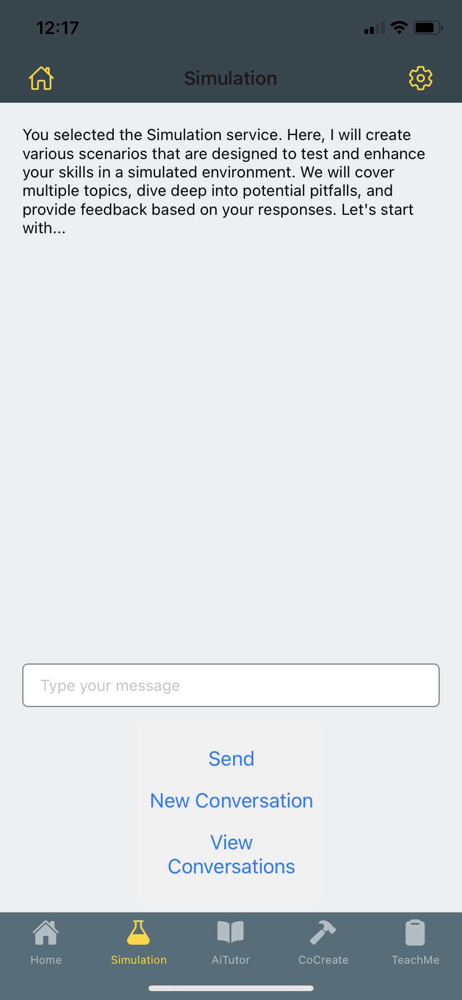
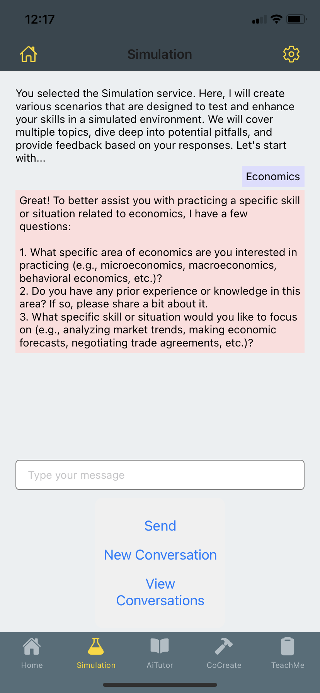
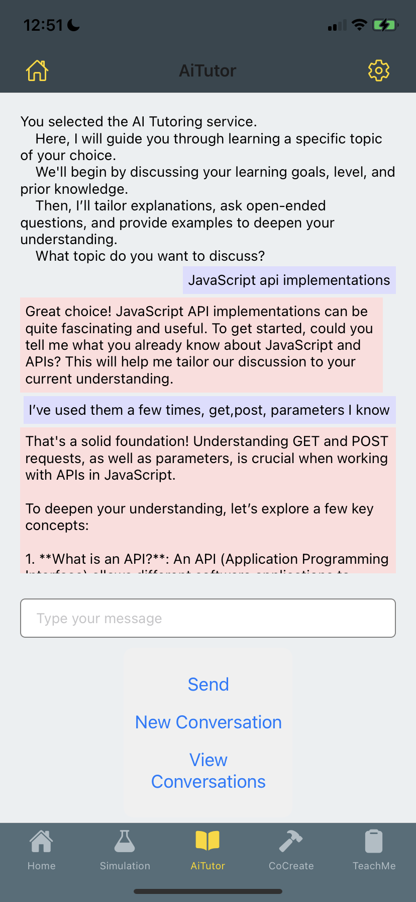
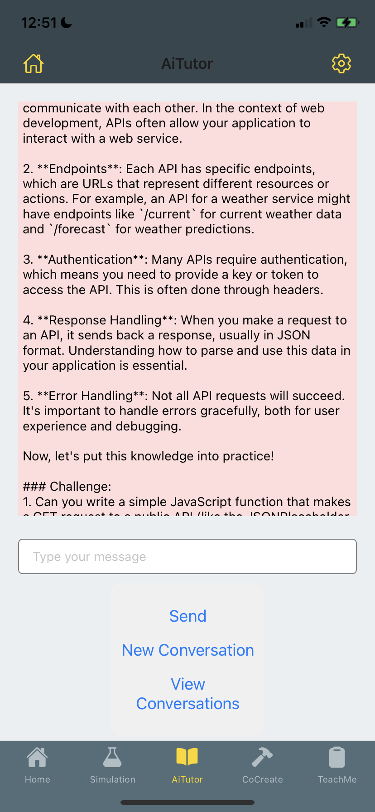

# AI-Enhanced Learning Assistant - TutorBot

This project implements an AI-powered learning assistant with multiple modes of interaction, leveraging Retrieval Augmented Generation (RAG) for enhanced contextual responses.

## Key Features

1. Multiple Learning Modes:
   - AI Tutor: tutors you about the given topic using examples and questions
   - Teach Me: user tutors the chatbot on the given topic by roleplaying as a curious student
   - Co-Create: works with the user to refine case studies based on the given topic 
   - Simulation: creates fictional scenarios about the given topic

2. RAG Implementation:
   - Utilizes embedded sections from a knowledge base
   - Retrieves relevant context for each user query
   - Enhances AI responses with domain-specific information

3. Conversation Management:
   - Save and load conversations
   - Start new conversations
   - View conversation history

4. User Interface:
   - Chat-like interface for all learning modes
   - Scrollable chat history
   - Input field for user messages
   - Send button for submitting queries
   - New Conversation button to start fresh
   - View Conversations button to access history

5. Cross-Platform:
   - Built with React Native for iOS and Android compatibility

6. User Authentication:
    - Supports user ID and email for personalized experiences

7. Flexible Navigation:
    - Allows switching between different screens and modes

Screen examples:

