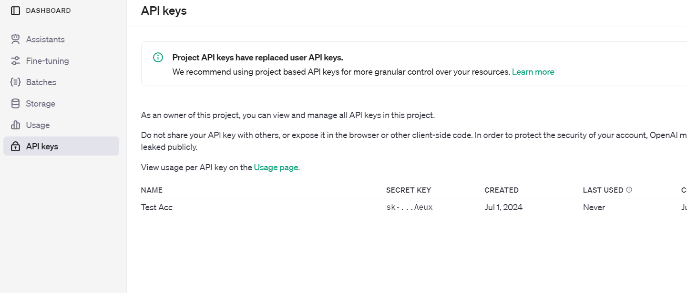

# Creating a Mobile App from Scratch (order of events still underway)

## Everything essential to running the Mobile App

### Command Prompt
**windows only**  

#### base CMD
navigating down to a directory
```
> cd <directory>
```
navigating up to parent directory
```
> cd ..
```
display a list of files and directories in the current directory
```
> dir
```
creating directories
```
mkdir [directory_name]
```
#### Node and NPM
what's the purspose of npm?  
collaboration, version control, initializing

organizing npm  
first, install directly from the website: [npm](https://nodejs.org/en)  

next, navigate to the directory you want to implement npm
```
cd path/to/your/project
```

initialize the project
```
npm init
```

how to install necessary dependencies
```
npm install [package]
```

#### Expo dev
start with the [expo docs](https://docs.expo.dev/)  

in order to view your expo app, you must install Expo Go on the App Store or similar 

first, install expo on npm
``` 
npm install [expo]
```

initialize a new app with blank template
```
npx create-expo-app StickerSmash --template blank
```

#### React mobile dependencies

3 main packages needed for mobile dev:  
base react package
```
npm install react
```

mobile react package
```
npm install react-native
```

secure secrets and apikey
```
npm install react-native-dotenv
```

alternatively, install them all at the same time:
```
npm install react react-native react-native-dotenv
```

### VSC

command prompt/terminal available here  
use to run most code

### Git / Github

importance of version control software  
>building in steps  
>ability to revert changes when things break  
>keeping track of the changes made  
>working on multiple computers or with other devs 

### ChatGPT Prompting
#### Tips on Maximing ChatGPT support:
>giving as much context as possible  
>providing example or similar functioning code  
>edit prompts instead of sending new message when output is off

#### ChatGPT's main purposes for these types of projects
>build foundation code  
>explain how code is working  
>debug errors  
>suggest next steps  
>good prompting saves time and enhances understanding. lazy prompting often makes things take longer and break more easily

### CSS Styling

### Dev Environment vs Production Level

## Development of App

### What do you want the app to accomplish?

1. define core functioning
2. separate into parts
- FRONTEND - what the user sees and interacts with
- BACKEND - the software the runs the actions that make the app necessary

## My Example

### Initial Project Idea

based on a research paper: Instructors as Innovators: A future-focused approach to new AI learning opportunities, with prompts

>this paper argued that generative AI could be used to create and enhance personalized learning experiences for students. the authors also generously provided prompts and blueprints to recreate AI supported exercises to enhance learning  
>Realizing a completed and generalized app version of these concepts could provide a lot of value to students and instructors, i decided to take this on as a project

### Breaking down project into parts

#### How to access OpenAI's API in Javascript

start with the [OPEN API REFERENCE](https://platform.openai.com/docs/api-reference/)  

how to get a API Key  
>Create an OpenAI account
>

how to secure API key in the code

create a .env file in your project. name a variable for your API key and use the key as the value
```
OPENAI_API_KEY=YOUR_API_KEY
```

And Implement the code like this:
```
const openai = new OpenAI({
    apiKey: process.env.OPENAI_API_KEY
});
```
I NEED TO ADJUST CODE SO IT ACTUALLY USES THIS METHOD

for most cases, 'gpt-4o-mini' or 'gpt-3.5-turbo' will make the best balance of cost and performance

#### Testing Basic Requests

The main api endpoint I need for this project is chat completions.  

The best way to understand more about how it works is by running the example code: 

```
import OpenAI from "openai";

const openai = new OpenAI();

async function main() {
  const completion = await openai.chat.completions.create({
    messages: [{ role: "system", content: "You are a helpful assistant." }],
    model: "gpt-4o",
  });

  console.log(completion.choices[0]);
}

main();
```

The main parts seem to be
>import openai's package  
>set a const for a each request
>

#### Running basic idea in command prompt

#### How to Retain Conversation History

#### how to build mobile app interface

#### how to preset the AI for specific types of tasks

#### how to implement backend services as intended

#### how to improve user interface

#### elevating software to production level (and what that means)

#### all preparations needed to host app on app store